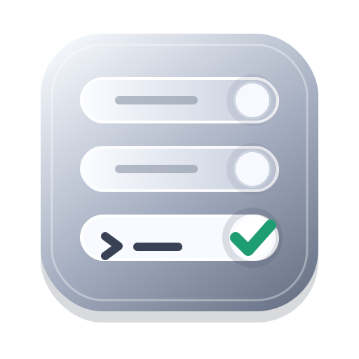

<p align="center">
  
</p>

<h1 align="center">Apple Container Operator</h1>

<p align="center">
  一个解决问题的 operator：让 AI agent 安全地理解、翻译、安装、更新并执行 Apple 原生 <code>container</code> 工作流。
</p>

<p align="center">
  <a href="./LICENSE"></a>
  
  
</p>

<p align="center">
  <a href="./README.en.md">English</a> | 简体中文
</p>

Apple Container Operator 让 AI agent 安全地理解、翻译、安装、更新并执行 Apple 原生 `container` 工作流。

> 把 Docker 命令当作意图来源，把 Apple `container` 当作真实执行目标；能确定就执行，不确定就先查本机 help。

## 快速开始

每次调用这个 skill 时，agent 应该先做一次轻量更新检查：确认 Apple Container Operator skill 是否为最新版本；涉及 Apple `container` 的操作时，也检查本机 `container` 是否已安装以及是否可能有新版本。用户不需要专门记得发送“更新 skill”的提示词。

### 安装这个 Skill Pack

把下面这段发给你的 AI coding agent：

```text
Install the Apple Container Operator skill pack from https://github.com/lizhelang/apple-container-operator.

Clone the repository, inspect its README and skills/apple-container/SKILL.md, then install or reference the apple-container skill in your local agent skill/rules system so future requests about Apple container use this skill automatically.
```

### 安装 Apple Container

装好 skill pack 后，把下面这段发给 AI：

```text
Use the apple-container skill to install Apple's native container runtime on this Mac.

Follow the skill's installation workflow: verify this is an Apple silicon Mac, check the macOS version, download the latest official signed installer package from apple/container GitHub Releases, install it with the macOS installer, run container --version, start the system service with container system start, and verify the result. Do not install Docker Desktop as a substitute.
```

### 一次性安装 Skill Pack 和 Apple Container

如果想一步完成，把下面这段发给 AI：

```text
Set up Apple Container Operator end to end.

First install the Apple Container Operator skill pack from https://github.com/lizhelang/apple-container-operator into your local agent skill/rules system. Then use that skill to install Apple's native container runtime on this Mac from the official apple/container GitHub Releases signed installer package. Verify Apple silicon and macOS support, install the package, run container --version, start container system service, and report the final status. Do not install Docker Desktop as a substitute.
```

### 把 Docker 上部署的服务迁移到 Apple Container

把下面这句话发给 AI，它会帮你盘点 Docker 侧的服务并迁移到 Apple `container`：

```text
Use Apple Container Operator to inspect my Docker-based service setup, identify images, ports, env vars, volumes, commands, dependencies, and stateful data, then create and execute a safe migration plan to Apple's native container runtime without assuming full Docker or Compose parity.
```

### 用 Apple Container 运行一个 GitHub 项目

很多开源项目没有 Apple `container` 专用说明。你可以把仓库链接发给 AI，让它先分析项目，再问清楚缺失配置：

```text
Use Apple Container Operator to inspect this GitHub repository and create an Apple container setup plan: https://github.com/OWNER/REPO.

Clone only after confirming the target location if needed. Analyze Dockerfile, Compose files, README, env examples, package metadata, ports, commands, and persistent data needs. Ask me for missing configuration such as service choice, environment variable values, host ports, mounts, image tag, build args, and startup command before building or running containers.
```

## 安装与使用

### 通用 AI Agent

把 `skills/apple-container/SKILL.md` 复制、引用或安装到你的 agent skill / rules 系统里。这个 skill 会把细节路由到 `skills/apple-container/references/`，并使用 `skills/apple-container/scripts/` 里的确定性小脚本。

常用检查脚本：

```sh
skills/apple-container/scripts/detect-container.sh
skills/apple-container/scripts/install-container.sh --check
skills/apple-container/scripts/inspect-state.sh
skills/apple-container/scripts/analyze-repo-setup.py /path/to/repo
skills/apple-container/scripts/update-skill.sh --check
```

在假设本地命令或 flag 可用之前，agent 应该先检查 `container --help` 和相关子命令 help。

### Codex

Codex 可以使用根目录的 `AGENTS.md` 作为项目级说明。处理 Apple container 请求时，先加载 `skills/apple-container/SKILL.md`，再按需要阅读 reference 文件。

### Claude Code

Claude Code 可以参考 `agents/CLAUDE.md`。它保留了同样的可移植行为，不依赖 Codex 专用 API。

### Cursor

Cursor 可以使用 `agents/cursor-rules.md` 作为项目规则。修改 Docker 风格翻译行为时，应同步更新测试。

## 示例

用户：`帮我跑一个 postgres，密码设成 pass，端口暴露到本机`

Agent 行为：识别为 `run_container`，检查 `container run --help`，规划环境变量和端口映射，提醒数据库持久化风险，然后只生成经过本地 help 验证的 `container run` 命令。

用户：`docker ps`

Agent 行为：把它理解成 `list_containers`，翻译成 Apple container 的容器列表工作流，并在不确定时检查精确 list 语法。

用户：`docker logs -f app`

Agent 行为：把它理解成 `view_logs`，如果 Apple container 支持 logs follow，再使用 follow flag；否则给出安全替代方案。

用户：`把 app 的端口从 3000 改成 8080`

Agent 行为：识别为 `configuration_change`，先检查当前配置；如果不能原地修改，就生成尽量保留镜像、环境变量、挂载、命令和名称的停止 / 重建计划。

用户：`这个容器启动不了，帮我 debug`

Agent 行为：按顺序检查系统、镜像、容器状态、日志、命令与配置、端口和挂载，然后给出最小复现建议。

用户：`帮我安装 Apple container`

Agent 行为：检查 Apple silicon 和 macOS 支持，从官方 `apple/container` GitHub Release 下载最新 signed installer package，用 macOS installer 安装，然后启动并验证 system service。

用户：`用 container 安装这个 GitHub 项目：https://github.com/OWNER/REPO`

Agent 行为：识别为 `github_project_setup`，先确认是否 clone 以及 clone 到哪里；在本地 checkout 上静态分析 Dockerfile、Compose、README、包管理文件和 `.env.example`，再列出需要用户确认的端口、环境变量、挂载、镜像 tag、构建参数、启动命令和服务选择。确认前不运行 build 或创建容器。

## 兼容性说明

Apple `container` 不是 Docker。Docker 风格命令在本项目里只是“意图来源”，不是 Apple container 支持相同 flag 或工作流的证明。Agent 和维护者在假设某个 flag 可用前，应先检查本地 `container` CLI help 和版本。
